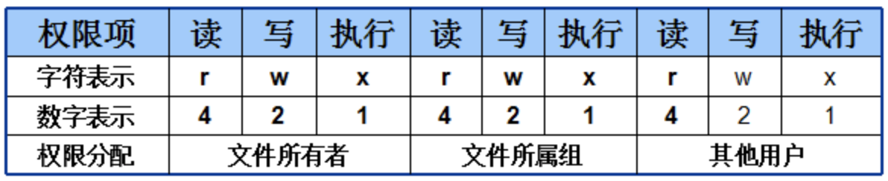

# 常用命令

## 工作命令
### echo
echo命令用于在终端输出字符串或变量提取后的值

    echo $SHELL

### date
date命令用于显示及设置系统的时间或日期，格式为“date [选项] [+指定的格式]”。  
%t	跳格[Tab键]  
%H	小时（00～23）  
%I	小时（00～12）  
%M	分钟（00～59）  
%S	秒（00～59）  
%j	今年中的第几天  

    date "+%Y-%m-%d %H:%M:%S"

### reboot
reboot命令用于重启系统
### poweroff
poweroff命令用于关闭系统
### wget 
wget命令用于在终端中下载网络文件，格式为“wget [参数] 下载地址”。  
-b	后台下载模式  
-P	下载到指定目录  
-t	最大尝试次数   
-c	断点续传  
-p	下载页面内所有资源，包括图片、视频等  
-r	递归下载  

### ps
ps命令用于查看系统中的进程状态  
-a	显示所有进程（包括其他用户的进程）  
-u	用户以及其他详细信息  
-x	显示没有控制终端的进程  

### top
top命令用于动态地监视进程活动与系统负载等信息  
### pidof
pidof命令用于查询某个指定服务进程的PID值，格式为“pidof [参数] [服务名称]”。
### kill 
kill命令用于终止某个指定PID的服务进程，格式为“kill [参数] [进程PID]”。
### killall
killall命令用于终止某个指定名称的服务所对应的全部进程，格式为：“killall [参数] [服务名称]”。

## 信息查询命令

### ifconfig
ifconfig命令用于获取网卡配置与网络状态等信息，格式为“ifconfig [网络设备] [参数]”。
### uname
uname命令用于查看系统内核与系统版本等信息，格式为“uname [-a]”。
### uptime 
uptime用于查看系统的负载信息，格式为uptime。
### free 
free用于显示当前系统中内存的使用量信息，格式为“free [-h]”。
### who
who用于查看当前登入主机的用户终端信息，格式为“who [参数]”。
### last 
last命令用于查看所有系统的登录记录，格式为“last [参数]”。
### history
history命令用于显示历史执行过的命令，格式为“history [-c]”。
### sosreport
sosreport命令用于收集系统配置及架构信息并输出诊断文档，格式为sosreport。

## 目录命令
### pwd 
pwd命令用于显示用户当前所处的工作目录，格式为“pwd [选项]”。  
### cd 
cd命令用于切换工作路径，格式为“cd [目录名称]”。
### ls
ls命令用于显示目录中的文件信息，格式为“ls [选项] [文件] ”。
### cat 
cat命令用于查看纯文本文件（内容较少的），格式为“cat [选项] [文件]”。
### more 
more命令用于查看纯文本文件（内容较多的），格式为“more [选项]文件”。
### head 
head命令用于查看纯文本文档的前N行，格式为“head [选项] [文件]”。
### tail
tail命令用于查看纯文本文档的后N行或持续刷新内容，格式为“tail [选项] [文件]”。
### tr 
tr命令用于替换文本文件中的字符，格式为“tr [原始字符] [目标字符]”。
### wc
wc命令用于统计指定文本的行数、字数、字节数，格式为“wc [参数] 文本”。
### stat 
stat命令用于查看文件的具体存储信息和时间等信息，格式为“stat 文件名称”。
### cut 
cut命令用于按“列”提取文本字符，格式为“cut [参数] 文本”。
### diff
diff命令用于比较多个文本文件的差异，格式为“diff [参数] 文件”。

## 文件目录管理命令

### touch
touch命令用于创建空白文件或设置文件的时间，格式为“touch [选项] [文件]”。  
-a	仅修改“读取时间”（atime）  
-m	仅修改“修改时间”（mtime）  
-d	同时修改atime与mtime
### mkdir
mkdir命令用于创建空白的目录，格式为“mkdir [选项] 目录”。
### cp
cp命令用于复制文件或目录，格式为“cp [选项] 源文件 目标文件”。  
-p	保留原始文件的属性  
-d	若对象为“链接文件”，则保留该“链接文件”的属性  
-r	递归持续复制（用于目录）  
-i	若目标文件存在则询问是否覆盖  
-a	相当于-pdr（p、d、r为上述参数）  
### mv
mv命令用于剪切文件或将文件重命名，格式为“mv [选项] 源文件 [目标路径|目标文件名]”。
### rm 
rm rm命令用于删除文件或目录，格式为“rm [选项] 文件”
### dd
dd命令用于按照指定大小和个数的数据块来复制文件或转换文件，格式为“dd [参数]”。  
if	输入的文件名称  
of	输出的文件名称  
bs	设置每个“块”的大小  
count	设置要复制“块”的个数  
### file
file命令用于查看文件的类型，格式为“file 文件名”。

## 打包与解压
### tar 
tar命令用于对文件进行打包压缩或解压，格式为“tar [选项] [文件]”。  
-c	创建压缩文件  
-x	解开压缩文件  
-t	查看压缩包内有哪些文件  
-z	用Gzip压缩或解压  
-j	用bzip2压缩或解压  
-v	显示压缩或解压的过程  
-f	目标文件名  
-p	保留原始的权限与属性  
-P	使用绝对路径来压缩  
-C	指定解压到的目录
### grep 
grep命令用于在文本中执行关键词搜索，并显示匹配的结果，格式为“grep [选项] [文件]”。  
-b	将可执行文件(binary)当作文本文件（text）来搜索  
-c	仅显示找到的行数  
-i	忽略大小写  
-n	显示行号  
-v	反向选择——仅列出没有“关键词”的行。  
### find 
find命令用于按照指定条件来查找文件，格式为“find [查找路径] 寻找条件 操作”。

## 用户权限管理

### useradd
useradd命令用于创建新的用户，格式为“useradd [选项] 用户名”。  
-d	指定用户的家目录（默认为/home/username）  
-e	账户的到期时间，格式为YYYY-MM-DD.  
-u	指定该用户的默认UID  
-g	指定一个初始的用户基本组（必须已存在）  
-G	指定一个或多个扩展用户组  
-N	不创建与用户同名的基本用户组  
-s	指定该用户的默认Shell解释器  
### groupadd
groupadd命令用于创建用户组，格式为“groupadd [选项] 群组名”。
### usermod 
usermod命令用于修改用户的属性，格式为“usermod [选项] 用户名”。  
-c	填写用户账户的备注信息  
-d -m	参数-m与参数-d连用，可重新指定用户的家目录并自动把旧的数据转移过去  
-e	账户的到期时间，格式为YYYY-MM-DD  
-g	变更所属用户组  
-G	变更扩展用户组  
-L	锁定用户禁止其登录系统  
-U	解锁用户，允许其登录系统  
-s	变更默认终端  
-u	修改用户的UID  
### passwd 
passwd命令用于修改用户密码、过期时间、认证信息等，格式为“passwd [选项] [用户名]”。  
-l	锁定用户，禁止其登录  
-u	解除锁定，允许用户登录  
--stdin	允许通过标准输入修改用户密码，如echo   "NewPassWord" | passwd --stdin Username  
-d	使该用户可用空密码登录系统  
-e	强制用户在下次登录时修改密码  
-S	显示用户的密码是否被锁定，以及密码所采用的加密算法名称 
### userdel 
userdel命令用于删除用户，格式为“userdel [选项] 用户名”。  
-f	强制删除用户
-r	同时删除用户及用户家目录

### 文件类型
 -：普通文件。

d：目录文件。

l：链接文件。

b：块设备文件。

c：字符设备文件。

p：管道文件。

### 在Linux系统中，每个文件都有所属的所有者和所有组，并且规定了文件的所有者、所有组以及其他人对文件所拥有的可读（r）、可写（w）、可执行（x）等权限。对于一般文件来说，权限比较容易理解：“可读”表示能够读取文件的实际内容；“可写”表示能够编辑、新增、修改、删除文件的实际内容；“可执行”则表示能够运行一个脚本程序。文件的读、写、执行权限可以简写为rwx，亦可分别用数字4、2、1来表示，文件所有者，所属组及其他用户权限之间无关联

### chattr
chattr命令用于设置文件的隐藏权限，格式为“chattr [参数] 文件”。  
i	无法对文件进行修改；若对目录设置了该参数，则仅能修改其中的子文件内容而不能新建或删除文件  
a	仅允许补充（追加）内容，无法覆盖/删除内容（Append Only）  
S	文件内容在变更后立即同步到硬盘（sync）  
s	彻底从硬盘中删除，不可恢复（用0填充原文件所在硬盘区域）  
A	不再修改这个文件或目录的最后访问时间（atime）  
b	不再修改文件或目录的存取时间  
D	检查压缩文件中的错误  
d	使用dump命令备份时忽略本文件/目录  
c	默认将文件或目录进行压缩  
u	当删除该文件后依然保留其在硬盘中的数据，方便日后恢复  
t	让文件系统支持尾部合并（tail-merging）  
x	可以直接访问压缩文件中的内容  
### lsattr
lsattr命令用于显示文件的隐藏权限，格式为“lsattr [参数] 文件”。
### setfacl
setfacl命令用于管理文件的ACL规则，格式为“setfacl [参数] 文件名称”。
### getfacl
getfacl命令用于显示文件上设置的ACL信息，格式为“getfacl 文件名称”。

### sudo without password

    [root@root ~]# visudo
    98 root ALL=(ALL) ALL
    99 linuxprobe ALL=NOPASSWD: /usr/sbin/poweroff