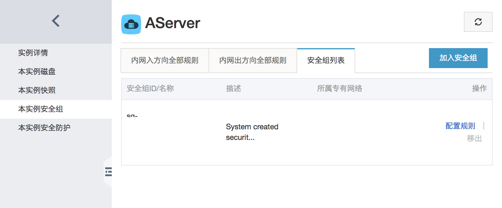
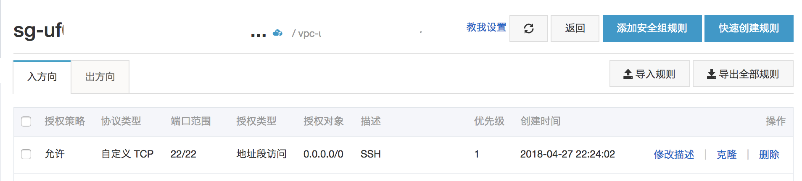
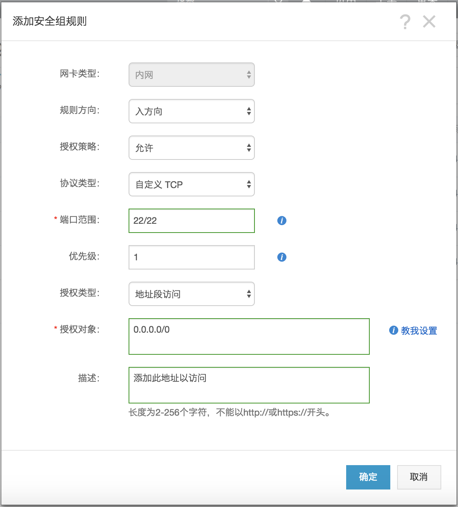

# 远程服务器的搭建
## 1.进入之前的准备
阿里云服务器需要额外配置一点  

  

点击右侧的`配置规则`，进入规则配置界面  

  

点击右上角`添加安全规则`,添加新的连接规则

参照上图完成新的安全组规则的建立，而后就能使用自带的远程连接来登录远程服务器。

## 2.进入

点击远程连接后进入弹出的远程连接界面  
会弹出一个远程连接的密钥，这个需要自己记一下，每次使用Ali官方的远程连接的时候都需要输入这个数字来验证，输入之后进入服务器  
接下来输入用户名与密码进入系统  
用户名是明文的,会在终端上显示  
密码是不会回显的，即不会显示输入状态，但是也可以进行删除操作，输入完成后，按回车即可  
密码正确即进入系统，若忘记密码可返回ECS管理界面重置密码  

#### tips:建议新建一个普通权限的用户以进行操作，在需要管理员权限的时候使用命令 `sudo` or `su` 命令进行操作，需输入管理员密码  

## 3.SSH连接配置

使用Ali官方的网页终端较为繁琐，建议使用Mac系统下自带的Terminal或者iTerm2进行连接，或者使用Windows系统下安装一个XShell软件进行服务器的连接。  

### 3.1 MAC环境下的SSH连接

首先创建一个密钥对  

    sudo ssh-keygen -t rsa [-C "Comment"]
会提示放置密钥的文件夹位置，默认位置就可以，点一下回车，之后会提示输入使用该密钥对的时候所要使用的pass phrase，即密码，可以为空，按两下回车即可，如果输入了密码，之后使用该密钥进行连接时还需输入该密码。  
密钥默认的保存地址为 

    ~/.ssh/
包括两个密钥，一个是公钥，用以放在服务器上的，这个是公开的，另一个是私钥，放在自己电脑上的，不能够公开的  
默认的密钥对的为

    ~/.ssh/id_rsa.pub
    ~/.ssh/id_rsa
标有pub的是公钥。

接下来可以使用

    ssh-copy-id -p 22 -i ~/.ssh/id_rsa.pub user@hostname
`-p`是用以指明ssh端口号的，默认是22，可以省略，其他端口需明确指出  
`-i`用以指明ssh公钥文件  
命令执行后会提示指纹信息验证，输入yes即可，仅第一次验证  
之后需要输入`user@hostname`的用户密码  
之后会提示添加成功一个，可以使用命令进行测试  

### 3.2 Windows环境下的SSH连接

Windows默认没有SSH命令，需要在控制面板开启开发者模式，重启后安装相关文件，但是使用软件XShell较为便捷  
安装完成后选择新建连接

