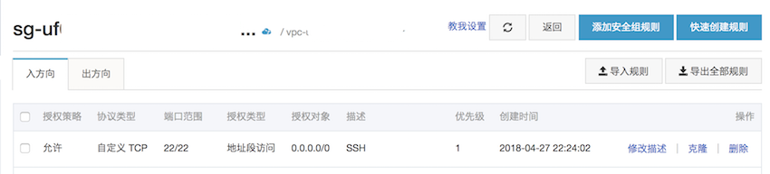
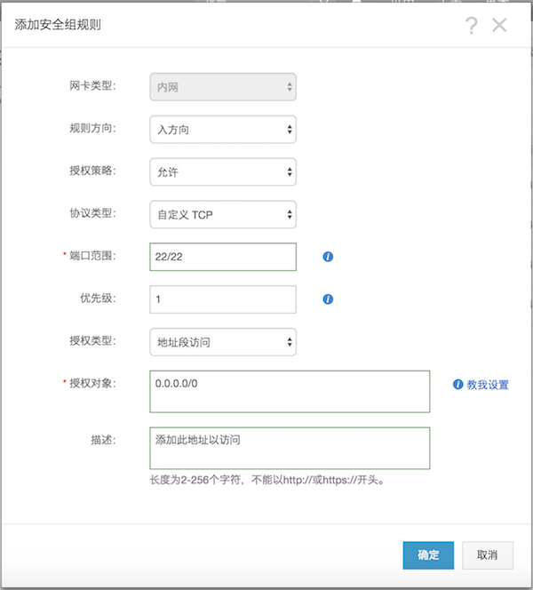

# 远程服务器的搭建
## 1.进入之前的准备
阿里云服务器需要额外配置一点  

  

点击右侧的`配置规则`，进入规则配置界面  

  

点击右上角`添加安全规则`,添加新的连接规则

参照上图完成新的安全组规则的建立，而后就能使用自带的远程连接来登录远程服务器。

## 2.进入

点击远程连接后进入弹出的远程连接界面  
会弹出一个远程连接的密钥，这个需要自己记一下，每次使用Ali官方的远程连接的时候都需要输入这个数字来验证，输入之后进入服务器  
接下来输入用户名与密码进入系统  
用户名是明文的，会在终端上显示  
密码是不会回显的，即不会显示输入状态，但是也可以进行删除操作，输入完成后，按回车即可  
密码正确即进入系统，若忘记密码可返回ECS管理界面重置密码  

#### tips:建议新建一个普通权限的用户以进行操作，在需要管理员权限的时候使用命令 `sudo` or `su` 命令进行操作，需输入管理员密码  

## 3.SSH连接配置

使用Ali官方的网页终端较为繁琐，建议使用Mac系统下自带的Terminal或者iTerm2进行连接，或者使用Windows系统下安装一个XShell软件进行服务器的连接。  

### 3.1 MAC环境下的SSH连接

首先创建一个密钥对
